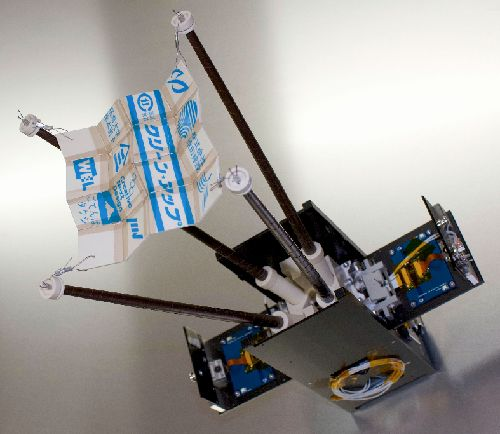

<h1 align="center">
  HIROGARI Decoder
</h1>

  Telemetry Decoder software for amateur radio mission of CubeSat "HIROGARI"

## Description

HIROGARI Decoder is the official software for amateur radio mission that decodes the telemetry from CubeSat "HIROGARI", developed by Osaka Prefecture University and Muroran Institute of Technology.

Amateur radio mission is a service to "EXPAND" communication through amateur radio. For the details, please refer to the following links.

### Links

-   [HIROGARI website](https://www.sssrc.aero.osakafu-u.ac.jp/activity/opusat-ii-project/)
-   [Amateur Radio Mission website](https://www.sssrc.aero.osakafu-u.ac.jp/hrg_amateur_mission/#/)

## Usage

### Decode

1. Select a WAVE file. Click "`SELECT FILE`" button or drop a file on the screen.
2. Select a communication mode from the drop-down list.
3. Click "`DECODE`" button.

### Report

1. After decoding, click "`REPORT THIS RECEPTION`" button.
2. Fill in the following items on the Reception Report form.
    - `Observer Name` (this name will appear on the Amateur Radio Mission website)
    - `Date and Time Received`
    - `Place Received` (optional)
3. To output QSL card, check "`Would you like a QSL card?`", and enter your call sign. (optional)
4. Click "`Send`" button.

Your report will be shared [here](https://www.sssrc.aero.osakafu-u.ac.jp/hrg_amateur_mission/#/receptionreports).

Thank you for your reports!

## FAQ

### Q. Can I change the display language?

### A.

You may change the language to English or Japanese from the menu.\
How to change language settings:

1. Go to [Help] - [Language]
2. Select [English] or [Japanese]

## Scripts (for developers)

-   `yarn build`: Build the software
-   `yarn start`: Build and launch the software
-   `yarn package:win`: Package the software for Windows
-   `yarn package:mac`: Package the software for macOS
-   `yarn package:linux`: Package the software for Linux
-   `yarn lint`: Run static code analysis
-   `yarn format`: Format the code

## License

[GNU General Public License v2.0](https://github.com/SSSRC/hirogari-decoder/blob/main/LICENSE)

## Author

[wowry](https://github.com/wowry), [SSSRC](https://github.com/SSSRC)
